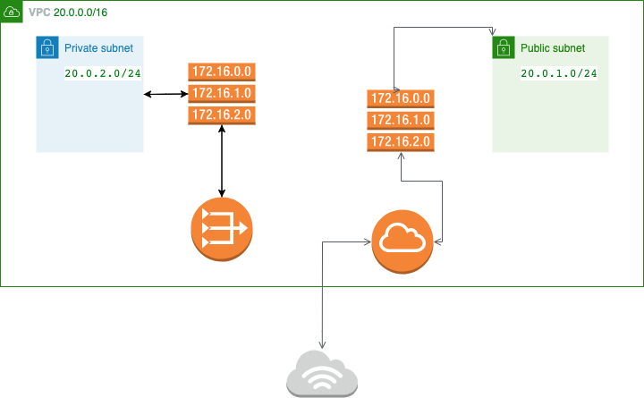

# Terraform with Terratest

## Working with AWS

### Networking

In this exercise we'll create a network with both a private and a public subnet.



#### Requirements

* Terraform 
  * (tested with v1.3.5)
* Terratest
  * (tested with v)
  * Go v1.19
* AWS account
  * The free layer is enough for this test

#### How to run

You can run terraform directly this way:

```shell

```

Or run the test with go:

```shell

```